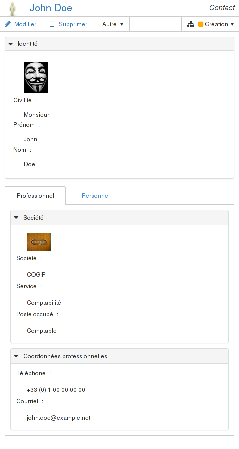
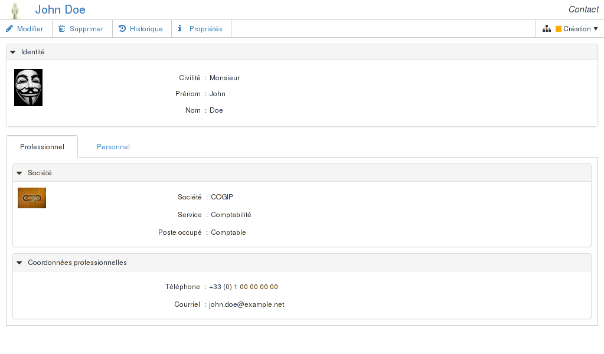
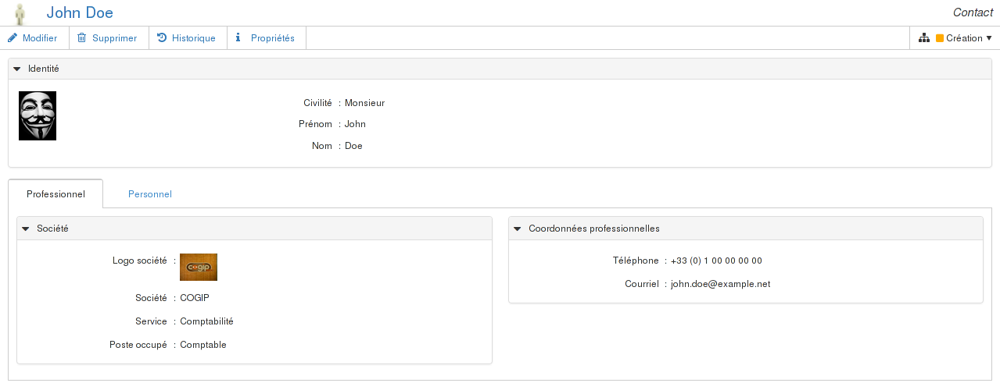
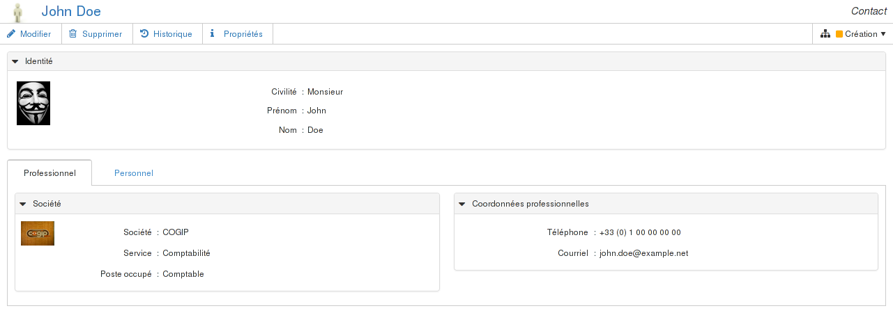

# Design adaptif (_responsive_) avec Dynacase Document UIs {#ddui-qs:92f1caed-e4f6-472e-8770-eed318c3a207}

Nous avons vu dans le chapitre précédent que le document est responsive par défaut :
en dessous de 480px, les libellés passent au dessus des attributs.
Nous allons voir dans ce chapitre comment aller plus loin.

## Principe {#ddui-qs:8330f8b1-60c7-4a48-baa6-ed83eaecc180}

Nous allons injecter une CSS qui change la mise en forme du document, afin de le rendre responsive.
L'objet de ce chapitre n'est pas d'expliquer la CSS, mais de montrer comment on peut

-   adresser les éléments générés
-   surcharger un template pour ajouter d'autres éléments adressables en css

Voici à quoi ressemblera le document final :

## Mise en œuvre du design responsive {#ddui-qs:f2c59069-c951-4310-85e6-4dbada3af1e2}

### Mise en place du contrôle de rendu {#ddui-qs:4c4da56f-0828-4a49-b1ba-8f24419aaf8f}

Nous allons créer un [contrôle de rendu][ddui-ref_controle-rendu] afin de surcharger le rendu du document.
Pour rappel, le contrôle de rendu se manipule de la même manière que le contrôle de vue :

-   il est créé
-   il est ensuite attaché à la famille
    +   soit au moyen du cycle de vie
    +   soit directement sur la famille

#### Récupération des sources {#ddui-qs:9d17f619-f5db-4a78-83ec-50cda72ff6aa}

Les sources avant cette étape correspondent au [tag `step-30-00`][step-30-00].

#### Paramétrage {#ddui-qs:fff4857a-08a8-4221-9098-fc99072681c0}

Le contrôle de rendu fera référence à une [classe de rendu][ddui-ref_classe-rendu].
Cette classe de configuration rendu doit être initialisée avant création du contrôle de rendu.
Elle sera utilisée pour modifier le rendu du document dans les étapes suivantes.

Voici le contenu du fichier [`DDUI_TUTO/Families/DDUI_TUTO_CONTACT/ContactRenderConfigView.php`](https://github.com/Anakeen/dynacase-ddui-quickstart-code/blob/step-30-10/DDUI_TUTO/Families/DDUI_TUTO_CONTACT/ContactRenderConfigView.php "Télécharger le fichier complété") :

    [php]
    <?php
    
    namespace DduiTuto;
    
    class ContactRenderConfigView extends \Dcp\Ui\DefaultView
    {
    
    }

Une fois cette classe [déployée](#ddui-qs:ac5c3a68-475f-45f7-9a9c-631101f727ab),
le contrôle de rendu peut être créé à cette adresse :
[http://localhost:8080/?app=GENERIC&action=GENERIC_EDIT&classid=CVRENDER](http://localhost:8080/?app=GENERIC&action=GENERIC_EDIT&classid=CVRENDER)

Nous allons le compléter avec les informations suivantes :

-   Titre : `Contact (Contrôle de rendu)`
-   Famille : `Contact`
-   Vues : une seule vue, avec les éléments suivants
    +   Identifiant de la vue : `DEFAULT_VIEW`
    +   Label : `Consultation`
    +   Type : `Consultation`
    +   Classe de configuration de rendu : `\DduiTuto\ContactRenderConfigView`
    +   Masque : vide
    +   Ordre de sélection : `10`
    +   Affichable : `Non`
    +   Menu : vide

Une fois ajouté dans le workflow de la famille Contact pour chacun des états, exporté,
et correctement ajouté au fichier [`DDUI_TUTO/Families/DDUI_TUTO_CONTACT/DDUI_TUTO_CONTACT__DATA.csv`](https://github.com/Anakeen/dynacase-ddui-quickstart-code/blob/step-30-10/DDUI_TUTO/Families/DDUI_TUTO_CONTACT/DDUI_TUTO_CONTACT__DATA.csv "Télécharger le fichier complété"),
il peut être déployé.

#### Déploiement {#ddui-qs:ac5c3a68-475f-45f7-9a9c-631101f727ab}

Les sources telles que déployées à cette étape correspondent au [tag `step-30-10`][step-30-10]

Le déploiement se fait au moyen du _developer toolkit_
(pour plus d'explications sur les outils de développement, se rendre sur [leur documentation][devtools-ref]) :

-   pour linux :
    
        php dynacase-devtool.phar deploy -u localhost -p 8080 -c dynacase -s path/to/sources --auto-release

-   pour windows :
    
        dynacase-devtool.bat deploy -u localhost -p 8080 -c dynacase -s path/to/sources --auto-release

 Puisque le contrôle de rendu a été associé au cycle de vie
après la création du document que nous manipulons, il n'est pas associé automatiquement.
Il faudrait soit écrire un script de migration, soit créer un nouveau document.
Pour plus de simplicité, nous avons intégré une méthode à notre document pour refaire l'association.

il suffit de se connecter à l'adresse
[http://localhost:8080/?app=FDL&action=FDL_METHOD&id=CONTACT_JOHN_DOE&method=updateCR](http://localhost:8080/?app=FDL&action=FDL_METHOD&id=CONTACT_JOHN_DOE&method=updateCR)

#### Le résultat {#ddui-qs:84d478b7-c22f-4184-808b-2da2229d2f55}

En consultant le contact _John DOE_ à l'adresse [http://localhost:8080/api/v1/documents/CONTACT_JOHN_DOE.html](http://localhost:8080/api/v1/documents/CONTACT_JOHN_DOE.html),
aucun changement n'est perceptible.
En effet, nous avons juste mis en place les points d'entrée pour nos personnalisation à venir.

### CSS uniquement {#ddui-qs:facce5f5-bfb8-4192-a5bb-acb1562e81b6}

Nous allons dans cette partie voir comment surcharger le rendu uniquement par CSS.

L'objectif est de

-   Quelle que soit la résolution :
    +   Retirer le libellé de la photo
-   En dessous de 1024px :
    +   Retirer le libellé du logo
-   à partir de 480px :
    +   positionner la photo à gauche du cadre "Identité",
    +   conserver le positionnement des autres éléments du cadre "Identité"
-   entre 480px et 1024px :
    +   Retirer le libellé du logo
    +   positionner la photo à gauche du cadre "Identité",
    +   conserver le positionnement des autres éléments du cadre "Identité"
-   à partir de 1024px :
    +   positionner les cadres "Société" et "Coordonnées professionnelles" côte à côte
-   à partir de 1280px :
    +   Retirer le libellé du logo
    +   positionner le logo à gauche du cadre "Société",
    +   conserver le positionnement des autres éléments du cadre "Société"

Soit, en images :

#### Récupération des sources {#ddui-qs:48d53f72-b22a-4db9-b0d2-a2732e236a39}

Les sources avant cette étape correspondent au [tag `step-30-10`][step-30-10].

#### Code {#ddui-qs:a2538ab3-be40-4650-89ce-20db41766692}

Nous devons en premier lieu injecter la nouvelle CSS dans le document en plus des CSS qu'il utilise déjà.
Pour ce faire, ajoutons une méthode [`getCssReferences`][ddui_ref:getCssReferences]
à notre classe de configuration de rendu dans le fichier
[`DDUI_TUTO/Families/DDUI_TUTO_CONTACT/ContactRenderConfigView.php`](https://github.com/Anakeen/dynacase-ddui-quickstart-code/blob/step-30-20/DDUI_TUTO/Families/DDUI_TUTO_CONTACT/ContactRenderConfigView.php "Télécharger le fichier complété") :

    [PHP]
    public function getCssReferences(\Doc $document = null)
    {
        $version = \ApplicationParameterManager::getParameterValue(
            "CORE", "WVERSION"
        );
    
        $cssReferences = parent::getCssReferences($document);
    
        $cssReferences['DDUI_TUTO_CONTACT_view']
            = "DDUI_TUTO/Families/DDUI_TUTO_CONTACT/Layout/view.css?ws="
            . $version;
    
        return $cssReferences;
    }

Nous pouvons maintenant écrire la CSS correspondante dans le fichier
[`DDUI_TUTO/Families/DDUI_TUTO_CONTACT/Layout/view.css`](https://github.com/Anakeen/dynacase-ddui-quickstart-code/blob/step-30-20/DDUI_TUTO/Families/DDUI_TUTO_CONTACT/Layout/view.css "Télécharger le fichier complété") :

    [css]
    /******************************************************************************
     cadre identité
    ******************************************************************************/
    
    /* masquage du label de la photo */
    label[data-attrid="dc_photo"] {
        display: none;
    }
    
    @media (min-width: 480px) {
    
        /* Positionnement de la photo à gauche */
        .dcpAttribute[data-attrid="dc_photo"] {
            float: left;
            width: 66px;
        }
    
        .dcpAttribute__content[data-attrid="dc_photo"] {
            padding: 0;
        }
    
        /* Restauration de la position initiale de tous les attributs autres que la photo */
        .dcpFrame__content[data-attrid=dc_fr_ident] .dcpAttribute:not([data-attrid="dc_photo"]) {
            float: right;
            width: calc(100% - 66px);
        }
    
        .dcpFrame__content[data-attrid=dc_fr_ident] label:not([data-attrid="dc_photo"]) {
            width: calc((100% / 3) - 44px);
        }
    }
    
    /******************************************************************************
     cadre Société
    ******************************************************************************/
    
    @media (max-width: 1024px),
           (min-width: 1280px) {
    
        /* masquage du label du logo */
        label[data-attrid="dc_logo"] {
            display: none;
        }
    }
    
    @media (min-width:480px) and (max-width:1024px),
           (min-width: 1280px) {
    
        /* Positionnement du logo à gauche */
        .dcpAttribute[data-attrid="dc_logo"] {
            float: left;
            width: 66px;
        }
    
        .dcpAttribute__content[data-attrid="dc_logo"] {
            padding: 0;
        }
    
        /* Restauration de la position initiale de tous les attributs autres que le logo */
        .dcpFrame__content[data-attrid=dc_fr_society] .dcpAttribute:not([data-attrid="dc_logo"]) {
            float: right;
            width: calc(100% - 66px);
        }
    
        .dcpFrame__content[data-attrid=dc_fr_society] label:not([data-attrid="dc_logo"]) {
            width: calc((100% / 3) - 44px);
        }
    }
    
    /******************************************************************************
     Positionnement côte à côte des cadres "Société" et "Coordonnées professionnelles"
    ******************************************************************************/
    @media (min-width: 1024px) {
        .dcpFrame[data-attrid=dc_fr_society],
        .dcpFrame[data-attrid=dc_fr_coord] {
            float: right;
            width: calc(50% - 10px);
        }
    
        .dcpFrame[data-attrid=dc_fr_society] {
            float: left;
        }
    
        .dcpFrame[data-attrid=dc_fr_coord] {
            float: right;
        }
    }

#### Déploiement {#ddui-qs:7695c92f-d77b-43b2-bbcf-8ef26bb53016}

Les sources telles que déployées à cette étape correspondent au [tag `step-30-20`][step-30-20]

Le déploiement se fait au moyen du _developer toolkit_
(pour plus d'explications sur les outils de développement, se rendre sur [leur documentation][devtools-ref]) :

-   pour linux :
    
        php dynacase-devtool.phar deploy -u localhost -p 8080 -c dynacase -s path/to/sources --auto-release

-   pour windows :
    
        dynacase-devtool.bat deploy -u localhost -p 8080 -c dynacase -s path/to/sources --auto-release

#### Le résultat {#ddui-qs:772de2b3-2c8a-4a60-80a5-b1f7b131c554}

En consultant le contact _John DOE_ à l'adresse [http://localhost:8080/api/v1/documents/CONTACT_JOHN_DOE.html](http://localhost:8080/api/v1/documents/CONTACT_JOHN_DOE.html),
on constate bien que les éléments sont réorganisés en fonction de la résolution.

### Utilisation des templates {#ddui-qs:05b15596-6671-4ff1-ba3a-c904a6e91d2d}

Dans la partie précédente, nous avons changé la mise en page uniquement au moyen de CSS.
Toutefois, il peut être nécessaire d'aller plus loin et de revoir entièrement la disposition des éléments.
Dans ce cas, la CSS n'est plus suffisante, et il faut alors passer par des templates.

Il est possible de définir un template pour un attribut en particulier, ou tout ou partie du document
(voir le [manuel de référence][ddui-ref_templates] pour plus d'explications sur les templates).

Nous allons définir un template qui surcharge l'intégralité du corps du document pour arriver à ce résultat :

#### Récupération des sources {#ddui-qs:b44968b5-6469-4bce-8563-17bf8649ca67}

Les sources avant cette étape correspondent au [tag `step-30-20`][step-30-20].

#### Code {#ddui-qs:cd338260-f74e-4b8c-b319-c9bd6599c606}

La première étape est d'indiquer le template à utiliser dans le fichier
[`DDUI_TUTO/Families/DDUI_TUTO_CONTACT/ContactRenderConfigView.php`](https://github.com/Anakeen/dynacase-ddui-quickstart-code/blob/step-30-30/DDUI_TUTO/Families/DDUI_TUTO_CONTACT/ContactRenderConfigView.php "Télécharger le fichier complété").
Cela se fait au moyen de la méthode [`getTemplates`][ddui-ref:getTemplates].
Nous allons également injecter 2 fichiers javascript, qui seront utilisés par la suite, au moyen de
la méthode [`getJsReferences`][ddui-ref:getJsReferences].
Voici le fichier final :

    [php]
    <?php
    
    namespace DduiTuto;
    
    class ContactRenderConfigView extends \Dcp\Ui\DefaultView
    {
        public function getTemplates(\Doc $document = null)
        {
            $templates = parent::getTemplates($document);
            
            $templates["sections"]["content"]["file"]
                = "DDUI_TUTO/Families/DDUI_TUTO_CONTACT/Layout/contactContent.mustache";
            return $templates;
        }
    
        public function getJsReferences(\Doc $document = null)
        {
            $version = \ApplicationParameterManager::getParameterValue(
                "CORE", "WVERSION"
            );
    
            $jsReferences = parent::getJsReferences();
    
            $jsReferences["bootstrap_collapse"]
                = "lib/bootstrap/3/js/collapse.js?ws="
                . $version;
    
            $jsReferences["jsqr"]
                = "lib/jsqr/jsqr-1.0.2-min.js?ws="
                . $version;
    
            return $jsReferences;
        }
    
        public function getCssReferences(\Doc $document = null)
        {
            $version = \ApplicationParameterManager::getParameterValue(
                "CORE", "WVERSION"
            );
    
            $cssReferences = parent::getCssReferences($document);
    
            $cssReferences['DDUI_TUTO_CONTACT_view']
                = "DDUI_TUTO/Families/DDUI_TUTO_CONTACT/Layout/view.css?ws="
                . $version;
    
            return $cssReferences;
        }
    }

Nous pouvons maintenant définir notre template. ce template utilisera des variables mustache
pour récupérer les valeurs du document.
Ces variables sont présentées dans le [manuel de référence][ddui-ref_variables].

Le template ainsi obtenu dans le fichier
[`DDUI_TUTO/Families/DDUI_TUTO_CONTACT/Layout/contactContent.mustache`](https://github.com/Anakeen/dynacase-ddui-quickstart-code/blob/step-30-30/DDUI_TUTO/Families/DDUI_TUTO_CONTACT/Layout/contactContent.mustache "Télécharger le fichier complété")
est le suivant :

    [html]
    

        

            

                

                    

                        
                    

                    
                    

                        

                            

                                <h1 class="media-heading pull-right">
                                    {{document.attributes.dc_society.attributeValue.displayValue}}
                                </h1>
                            

                            

                                
                            

                        

                        {{{document.attributes.dc_civility.attributeValue.displayValue}}}
                        <h2 class="media-heading">
                            {{{document.attributes.dc_firstname.attributeValue.displayValue}}}
                            {{{document.attributes.dc_lastname.attributeValue.displayValue}}}
                        </h2>
                        
                        {{{document.attributes.dc_service.attributeValue.displayValue}}}&nbsp;({{{document.attributes.dc_role.attributeValue.displayValue}}})
                    

                

            

            

        

        
        

            

                <h3 class="panel-title">
                    <a class="collapsed" role="button" data-toggle="collapse" href="#collapseMore"
                       aria-expanded="true" aria-controls="collapseOne">
                        <i class="collapseMore__icon fa" /> En savoir plus
                    </a>
                </h3>
            

            

                

                    

                        

                            <i class="fa fa-phone"></i> {{{document.attributes.dc_workphone.htmlContent}}}
                        

                        

                            <i class="fa fa-mobile"></i> {{{document.attributes.dc_mobilephone.htmlContent}}}
                        

                        

                            <i class="fa fa-envelope"></i> {{{document.attributes.dc_workmail.htmlContent}}}
                        

                    

                    

                        

                            {{{document.attributes.dc_fr_workaddr.htmlView}}}
                        

                        

                            {{{document.attributes.dc_fr_homeaddr.htmlView}}}
                        

                    

                

            

        

    

En bonus dans la [version corrigée](https://github.com/Anakeen/dynacase-ddui-quickstart-code/blob/step-30-30/DDUI_TUTO/Families/DDUI_TUTO_CONTACT/Layout/contactContent.mustache "Télécharger le fichier complété"),
vous avez accès au code permettant de générer le QRcode.

Enfin, ce template s'accompagne de CSS. Nous allons donc réécrire le fichier
[`DDUI_TUTO/Families/DDUI_TUTO_CONTACT/Layout/view.css`](https://github.com/Anakeen/dynacase-ddui-quickstart-code/blob/step-30-30/DDUI_TUTO/Families/DDUI_TUTO_CONTACT/Layout/view.css "Télécharger le fichier complété") :

    [css]
    .dc__main {
        font-size: 16px;
        padding-top: 20px;
    }
    
    .dc__coord {
        text-align: center;
    }
    
    .dc__coord .dcpCustomTemplate--content {
        display: inline-block;
    }
    
    .dc__coord .fa {
        font-size: 150%;
        vertical-align: top;
        padding-top: 0.2em;
        width: 2em;
        text-align: center;
    }
    
    .dcpAttribute[data-attrid="dc_workpostalcode"],
    .dcpAttribute[data-attrid="dc_workcity"],
    .dcpAttribute[data-attrid="dc_homepostalcode"],
    .dcpAttribute[data-attrid="dc_homecity"] {
        float: left;
        display: inline-block;
        margin-right: 2px;
    }
    
    .dcpAttribute__content[data-attrid="dc_workpostalcode"],
    .dcpAttribute__content[data-attrid="dc_workcity"],
    .dcpAttribute__content[data-attrid="dc_homepostalcode"],
    .dcpAttribute__content[data-attrid="dc_homecity"] {
        width: auto;
    }
    
    .dcpAttribute__label {
        display:none;
    }
    
    .panel-heading[data-id="dc_fr_workaddr"], /* because of http://dev.dynacase.org/issues/6107 */
    .panel-heading[data-attrid="dc_fr_workaddr"],
    .panel-heading[data-id="dc_fr_homeaddr"], /* because of http://dev.dynacase.org/issues/6107 */
    .panel-heading[data-attrid="dc_fr_homeaddr"] {
        font-size: 14px;
    }
    
    .collapseMore__icon::before {
        content: "\f0da"; /* fa-caret-right */
    }
    
    a:not(.collapsed) .collapseMore__icon::before {
        content: "\f0d7"; /* fa-caret-down */
    }
    
    .panel-title a:hover {
        text-decoration: none;
    }
    
    .dc__qrCode {
        margin-top: 10px;
        text-align: center;
    }
    
    @media (min-width:768px) {
        .dc__summary,
        .dc__qrCode {
            float: left;
        }
        .dc__summary {
            width: calc(100% - 210px);
            padding-right: 10px;
        }
        .dc__qrCode {
            width: 210px;
            text-align: right;
            margin-top: 0;
        }
    }

#### Déploiement {#ddui-qs:50431844-4cb3-420b-bde8-f03f1cd512fc}

Les sources telles que déployées à cette étape correspondent au [tag `step-30-30`][step-30-30]

Le déploiement se fait au moyen du _developer toolkit_
(pour plus d'explications sur les outils de développement, se rendre sur [leur documentation][devtools-ref]) :

-   pour linux :
    
        php dynacase-devtool.phar deploy -u localhost -p 8080 -c dynacase -s path/to/sources --auto-release

-   pour windows :
    
        dynacase-devtool.bat deploy -u localhost -p 8080 -c dynacase -s path/to/sources --auto-release

#### Le résultat {#ddui-qs:dd54a044-6ae9-42c3-95d7-24aba3386c47}

En consultant le contact _John DOE_ à l'adresse [http://localhost:8080/api/v1/documents/CONTACT_JOHN_DOE.html](http://localhost:8080/api/v1/documents/CONTACT_JOHN_DOE.html),
la page ressemble à ce qui était attendu.
De plus, le redimensionnement de la page réorganise bien les éléments.

## Conclusion {#ddui-qs:0cdb2fbd-ebf7-427b-bf4f-7bd38e754754}

Vous avez vu dans cette partie qu'il est simple de changer la disposition des éléments d'un document au moyen de CSS,
que chaque attribut, ou même chaque sous-élément d'un attribut (libellé, valeur, etc.) est facilement adressable
en CSS, et que vous pouvez aussi définir des templates pour des mises en page plus complexes.

De plus, tout ce travail a été accompli en n'écrivant aucun autre php
que le code nécessaire pour définir notre template, et ajouter les assets au document.

Dans la partie suivante, nous allons voir comment travailler avec du code Javascript et php
pour personnaliser le comportement des documents.

<!-- links -->
[devtools-ref]:                 #devtools:
[step-30-00]:                   https://github.com/Anakeen/dynacase-ddui-quickstart-code/archive/step-30-00.zip
[step-30-10]:                   https://github.com/Anakeen/dynacase-ddui-quickstart-code/archive/step-30-10.zip
[step-30-20]:                   https://github.com/Anakeen/dynacase-ddui-quickstart-code/archive/step-30-20.zip
[step-30-30]:                   https://github.com/Anakeen/dynacase-ddui-quickstart-code/archive/step-30-30.zip
[ddui-ref_controle-rendu]:      #ddui-ref:32923fae-57b5-4e57-b048-b7342726101c
[ddui-ref_classe-rendu]:        #ddui-ref:3d4e2523-9e0b-45d3-aa96-4214d3668b28
[ddui-ref_templates]:           #ddui-ref:5c19913d-1687-4f31-956b-f590649eb5a0
[ddui-ref_variables]:           #ddui-ref:134bc49e-6529-4e95-8f07-6e02559c6d8f
[ddui_ref:getCssReferences]:    #ddui-ref:adc69358-11e1-42b7-b0ed-f91af6807758
[ddui-ref:getTemplates]:        #ddui-ref:5c19913d-1687-4f31-956b-f590649eb5a0
[ddui-ref:getJsReferences]:     #ddui-ref:0166b72c-f88a-4d76-b28a-a8bf93c3cb2d
